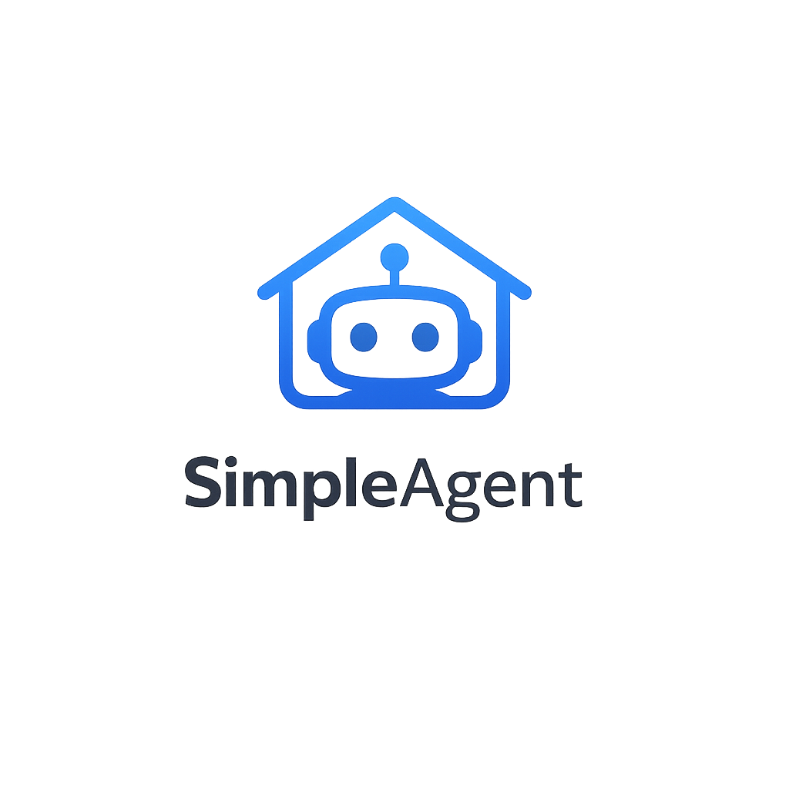
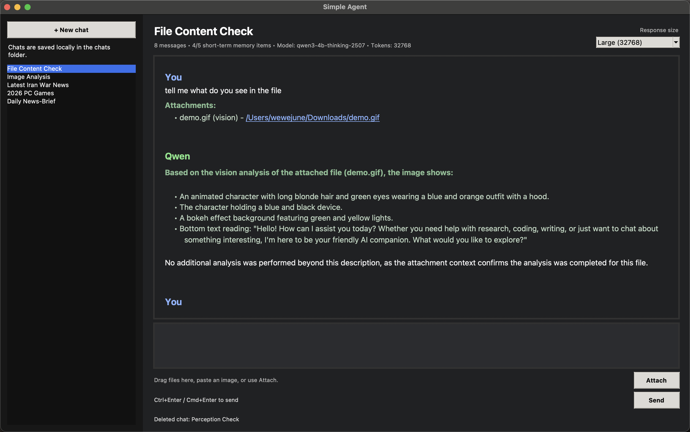

# SimpleAgent — Lightweight Local AI Agent

<p align="center">
  
</p>

SimpleAgent is a local-first desktop AI agent built for Apple Silicon.

It runs small local models with MLX and gives them a practical agent system around them: memory, chat directives, compressed per-chat workspaces, skill routing, an agent loop, persistent knowledge retrieval, file attachments, web search, URL scraping, vision analysis, text-file reading, PDF reading, code-file reading, and a simple GUI.

The goal is simple:

> Make small local models more useful by giving them structure, tools, and context.



---

## What SimpleAgent Can Do

SimpleAgent is more than a local chatbot.

It can:

- chat with a local Qwen model
- use a thinking model for stronger reasoning
- search the web when needed
- scrape user-provided URLs
- remember recent conversation summaries
- save chat-specific directives that are injected into every prompt in that chat
- use persistent per-chat knowledge retrieval with local embeddings
- store each chat inside its own compressed workspace folder
- use a lightweight agent loop to plan, act, observe, and answer
- read attached text and config files
- read attached PDF files
- read attached code files as a dedicated coding skill
- analyse attached images and videos with a vision model
- paste images directly from clipboard as attachments
- drag and drop files into the chat
- pin attachments so they stay available across prompts
- keep recent coding conversation context for multi-turn code edits
- retrieve relevant chunks from knowledge files instead of blindly injecting whole files
- display debug logs and raw model outputs in a console window
- show response time and token allowance after each reply
- render markdown-style formatting in the GUI

---

## Why This Exists

Small local models are useful, but they often struggle with agent behaviour.

They may:

- forget context quickly
- call tools when they should not
- fail to call tools when they should
- break strict JSON formats
- hallucinate when they lack information
- struggle with messy tool results

SimpleAgent avoids relying on fragile complex tool calling.

Instead, it uses a controlled skill-routing system, simple IDs, deterministic rules, memory summaries, and clear debugging output.

This makes a small model behave more like a practical assistant without needing a large cloud model.

---

## Main Features

### Local Chat

SimpleAgent runs a local Qwen model through MLX.

The current main model is a Qwen3 thinking model, which gives better reasoning than a normal instruction model.

It is used for:

- normal chat
- reasoning
- coding help
- final response generation
- skill routing
- search query generation
- chat titles
- memory summaries

Thinking output is handled safely. The app keeps the final answer clean instead of showing the full thinking trace in the chat.

---

### Date and Time Awareness

Every main prompt includes the current local date and time.

This helps the model understand phrases like:

- today
- tomorrow
- yesterday
- this week
- this month
- this year
- latest
- current

---

### Chat Directives

Each chat can have its own persistent directive.

The `Directive` button near the response token selector opens a popup where you can write instructions that apply to every prompt in the current chat.

This is useful for setting an underlying mission or style for a chat, such as:

- keep answers short
- focus on coding edits
- act as a project planning assistant
- use a specific writing style
- treat this chat as a research workspace

Directives are saved inside the compressed chat payload and are reloaded when the chat is opened again.

Directive rules:

- directives apply only to the current chat
- directives are injected before memory, knowledge, skills, and attachments
- directives should guide behaviour without overriding higher-priority system or safety rules
- the chat header shows whether the directive is on or off

---

### Lightweight Agent Loop

SimpleAgent now uses a lightweight agent loop for higher-quality answers.

The loop is:

```text
Think
↓
Act
↓
Observe
↓
Respond
```

In practice, this means:

| Step | What SimpleAgent does |
|---|---|
| Think | Understands the user's intent and what evidence is needed |
| Act | Runs selected skills such as web search, URL scraping, memory search, knowledge retrieval, attachment reading, vision, PDF reading, or code reading |
| Observe | Summarises and filters tool, knowledge, and attachment results so the final answer focuses on the user's actual request |
| Respond | Gives the final answer without exposing the internal loop |

The observation step is only used when it is useful, such as for tool results, retrieved knowledge chunks, PDFs, code files, resumes, documents, and large attachment context. Normal chat stays lightweight.

---

### Skill Routing

SimpleAgent uses numbered skills instead of complex JSON tool calls.

| Skill ID | Skill | What it does |
|---:|---|---|
| 0 | `no_skill` | Normal answer without tools |
| 1 | `internet_search` | Search online for current or factual information |
| 2 | `scrape_url` | Read and extract information from a URL |
| 3 | `memory_rag` | Search previous memory summaries |
| 4 | `attachment_vision` | Analyse attached images or videos |
| 5 | `text_file_reader` | Read attached text, markdown, config, CSV, JSON, YAML, and other text-like files |
| 6 | `pdf_reader` | Read extractable text from attached PDF files |
| 7 | `code_reader` | Read attached code files and support coding, debugging, refactoring, code review, implementation, and patch-style guidance |

The router can select one or more skills before generating the final answer.

Example:

```text
User asks for latest news
↓
Skill 1 runs internet search
↓
Search results are added to the prompt
↓
The model answers using the search context
```

---

### Internet Search

The internet search skill is used when the user asks for current, latest, factual, or online information.

It can be triggered by prompts like:

- search online
- latest news
- current price
- look this up
- what is happening today
- recent updates

The search flow is:

```text
User prompt
↓
Generate multiple search query variants
↓
Search online
↓
Deduplicate results
↓
Rank by relevance
↓
Re-rank with source quality scoring
↓
Fetch richer excerpts from top pages
↓
Observe and filter the results
↓
Add refined search context to final prompt
↓
Generate answer
```

Search result ranking can use MiniLM embeddings when available, with a keyword fallback.

The search system also applies lightweight source-quality scoring. It can boost more reputable sources depending on the query type, such as Reuters/AP/BBC for news, arXiv/Semantic Scholar/PubMed for research, official documentation for technical questions, and SEC/Yahoo Finance/Nasdaq-style sources for finance.

---

### URL Scraping

If the user provides a URL, SimpleAgent can scrape it and use the page content as context.

The flow is:

```text
User gives URL
↓
Extract URL
↓
Fetch page
↓
Use Playwright when JavaScript rendering is needed
↓
Clean page text
↓
Add relevant excerpt to prompt
```

This is useful for:

- summarising webpages
- extracting important points
- reading documentation pages
- asking questions about a specific link

---

### Memory

SimpleAgent stores lightweight memory after each turn.

The user and assistant summaries are generated together in one compact memory pass to reduce hidden compute.

After every response, it creates:

```json
{
  "user_summary": "...",
  "assistant_summary": "..."
}
```

These summaries are used in two ways:

| Memory type | Purpose |
|---|---|
| Recent memory injection | Adds recent summaries to the prompt automatically |
| Memory RAG | Searches older summaries when the user refers to previous discussion |

This gives the assistant continuity without storing huge full-history prompts.

---

### Persistent Knowledge Retrieval

SimpleAgent supports persistent knowledge files for each chat.

Knowledge files are different from normal attachments:

| Type | Behaviour |
|---|---|
| Normal attachments | Used for the current prompt unless pinned |
| Pinned attachments | Reused across prompts until unpinned or removed |
| Knowledge files | Saved permanently to the current chat as background reference material |

Knowledge files are managed through the `Knowledge` button near the response token selector.

The knowledge window supports:

- drag and drop files
- adding files with a file picker
- removing files with `X`
- persistent saved file paths per chat
- red missing-file indicators when a saved path no longer exists

The current knowledge retrieval flow is:

```text
Add knowledge files to chat
↓
Save file paths into the compressed chat payload
↓
Read supported knowledge files locally
↓
Split content into chunks
↓
Embed chunks with rag-all-minilm-l6-v2 when available
↓
Embed the current user prompt
↓
Select the most relevant chunks by similarity
↓
Add only the selected chunks to the final prompt
```

This makes large reference files more useful because SimpleAgent does not need to inject the whole file every time.

Supported knowledge files currently include:

- text files
- markdown files
- config files
- JSON/YAML/CSV-style files
- code-like files that can be read as text
- PDFs with extractable text

Image and video knowledge files can be saved as paths, but they are not automatically analysed as persistent knowledge yet.

If embedding retrieval is unavailable, SimpleAgent falls back to capped file previews so the feature still works.

---

### Attachments

SimpleAgent supports attachments through:

- drag and drop
- file picker
- image paste from clipboard

Attached files appear as chips in the composer.

Each attachment can be:

- removed with `X`
- pinned for reuse in the next prompt

Pinned attachments stay attached after sending a message. Unpinned attachments are cleared after the message is sent.

---

### Image and Video Attachments

Images and videos are routed to the vision skill.

Supported visual extensions include:

```text
.png, .jpg, .jpeg, .webp, .bmp, .gif,
.mp4, .mov, .avi, .mkv, .webm
```

The vision flow is:

```text
Attach image or video
↓
Skill 4 selected
↓
Qwen2.5-VL analyses the file
↓
Vision summary is added to the main prompt
↓
Qwen3 answers using that visual context
```

This can be used for:

- screenshots
- UI images
- charts
- visual documents
- candlestick chart screenshots
- pasted clipboard images

The vision model is run in a separate subprocess, so it is released from memory after analysis finishes.

---

### Text File Attachments

Text-like non-code files are routed to the text file reader skill.

Supported examples include:

```text
.txt, .md, .markdown, .rst, .log,
.csv, .tsv,
.json, .jsonl,
.yaml, .yml, .toml, .ini, .cfg, .conf,
.env, .xml, .tex, .bib,
.gitignore, .dockerignore, .editorconfig, .lock
```

The text file flow is:

```text
Attach text/config/data file
↓
Skill 5 selected
↓
File content is read locally
↓
Content is added to prompt
↓
Model answers using the file content
```

This is useful for:

- notes
- markdown documents
- config files
- CSV or TSV files
- JSON or YAML files
- logs
- plain-text references

---

### PDF Attachments

PDF files are routed to the PDF reader skill.

Supported extension:

```text
.pdf
```

The PDF flow is:

```text
Attach PDF
↓
Skill 6 selected
↓
PDF text is extracted locally
↓
Extracted text is added to prompt
↓
Agent observes the document content when useful
↓
Model answers using the PDF content
```

This can be used for:

- resumes
- reports
- papers
- invoices
- forms with extractable text
- general document review

PDF parsing uses local text extraction. Scanned or image-based PDFs may not contain extractable text.

---

### Code File Attachments

Code files are routed to a dedicated coding skill instead of the generic text reader.

Supported examples include:

```text
.py, .pyw, .ipynb, .sql,
.js, .jsx, .ts, .tsx, .mjs, .cjs,
.html, .htm, .css, .scss, .sass, .less,
.sh, .bash, .zsh, .fish, .bat, .ps1,
.java, .kt, .kts,
.c, .h, .cpp, .hpp, .cc, .cs,
.go, .rs, .swift, .php, .rb, .lua,
.r, .m, .scala, .dart,
.vue, .svelte, .astro
```

The code flow is:

```text
Attach code file or ask a coding question
↓
Skill 7 selected
↓
Code content is read locally
↓
Recent code conversation context is added when relevant
↓
Agent observes the code context when useful
↓
Model gives coding guidance or patch-style edits
```

This is useful for:

- explaining code
- finding bugs
- debugging errors
- refactoring
- reviewing code
- implementing features
- comparing multiple files
- generating patch-style edits

For multi-turn coding, SimpleAgent also includes recent code-related conversation context. This helps with follow-up prompts like:

```text
try again
fix it
continue
change the previous solution
apply the same idea to the other file
```

Attached code files remain the source of truth.

---

### Attachment Pinning

Attachments can be pinned.

This is useful when you want to keep asking questions about the same file.

Example:

```text
Attach simple_agent.py
Pin it
Ask: explain this file
Ask: where should I add PDF support?
Ask: split coding into its own skill
Ask: suggest a cleaner module split
```

The file stays available until you unpin or remove it.

---

### Temporary Attachments

Pasted clipboard images are saved into:

```text
temp_attachments/
```

The app includes a menu option to clear these temporary files.

This helps prevent pasted images from piling up over time.

---

### Console Output Window

SimpleAgent has a GUI console window.

It shows useful debugging information such as:

- raw model output
- skill router decisions
- selected skill IDs
- skill inputs
- skill outputs
- model errors
- PDF extraction warnings
- agent loop observation steps
- response logs

This makes the agent easier to debug without relying only on the PyCharm terminal.

---

### Markdown Formatting

The chat display supports common markdown-style formatting:

- headings
- bullets
- numbered lists
- bold text
- italic text
- inline code
- code blocks
- blockquotes
- horizontal dividers
- basic tables
- clickable links

This makes model responses easier to read in the GUI.

---

### Response Controls

The GUI includes response token options.

This is useful because thinking models can use many tokens before producing the final answer.

The app also shows response time after each reply, for example:

```text
Response generated. Tokens used allowance: 32768 • Time: 46.9s
```

Hidden helper prompts are kept as small as possible. Memory summarisation now combines the user and assistant summaries in one call to reduce compute.

Knowledge retrieval also reduces prompt size by selecting relevant chunks from persistent files instead of always passing full file contents.

Chat directives provide another lightweight control layer by letting each chat carry a persistent instruction without repeatedly typing it into every prompt.

---

## Model Setup

Current model roles:

| Role | Model | Runtime |
|---|---|---|
| Main reasoning model | Qwen3-4B-Thinking-2507 MLX 4-bit | `mlx-lm` |
| Vision model | Qwen2.5-VL-3B-Instruct MLX 4-bit | `mlx-vlm` |
| Embedding model | rag-all-minilm-l6-v2 / all-MiniLM-L6-v2 | `sentence-transformers` |

The main model handles chat and reasoning.

The vision model handles image and video attachments.

The embedding model helps with semantic ranking for memory, search results, and persistent knowledge retrieval.

PDF reading uses local PDF text extraction through Python libraries such as `pypdf`.

---

## Requirements

### Hardware

Recommended:

- Apple Silicon Mac: M1, M2, M3, or M4
- 16GB RAM or more

### Software

- macOS
- Python 3.10+
- Git

### Python packages

Core:

```bash
pip install mlx-lm
```

Recommended:

```bash
pip install sentence-transformers huggingface-hub zstandard
```

For vision attachments:

```bash
pip install mlx-vlm pillow torch torchvision
```

For drag and drop:

```bash
pip install tkinterdnd2
```

For webpage scraping with JavaScript rendering:

```bash
pip install playwright
python -m playwright install chromium
```

For PDF attachments:

```bash
pip install pypdf
```

---

## Setup

### 1. Clone the project

```bash
git clone <your-repo-url>
cd simpleagent
```

### 2. Create a virtual environment

```bash
python -m venv .venv
source .venv/bin/activate
```

### 3. Install dependencies

```bash
pip install -U pip
pip install mlx-lm mlx-vlm sentence-transformers huggingface-hub pillow tkinterdnd2 torch torchvision pypdf zstandard
```

Optional for webpage scraping:

```bash
pip install playwright
python -m playwright install chromium
```

### 4. Run the app

```bash
python simple_agent.py
```

### 5. Download models

Use the app menu:

```text
File → Download Models
```

Models are saved under:

```text
models/<model_key>/model/
```

---

## Local Folders

SimpleAgent stores local data in these folders:

| Folder | Purpose |
|---|---|
| `chats/<chat-id>__<slug>/` | Per-chat workspace folder for the compressed chat payload, future agent-created files, and chat-specific artifacts |
| `chats/<chat-id>__<slug>/chat.json.zst` | Compressed saved chat payload using Zstandard |
| `models/` | Downloaded local models |
| `temp_attachments/` | Pasted clipboard images and temporary attachments |

Each chat is stored inside its own folder. The chat payload is compressed with Zstandard as `chat.json.zst`, and the same chat folder also acts as the workspace for future agent-created files and chat-specific artifacts.

The compressed chat payload stores the chat messages, memory summaries, directive, knowledge file paths, and chat metadata. Knowledge files themselves remain referenced by path unless copied or created inside the chat workspace later.

Recommended `.gitignore` entries:

```text
models/
.venv/
chats/
temp_attachments/
```

---

## How The Agent Works

High-level flow:

```text
User sends message
↓
Save user message and attachments
↓
Prepare SimpleAgent identity context
↓
Prepare date/time context
↓
Prepare chat directive context
↓
Prepare recent memory context
↓
Retrieve relevant persistent knowledge chunks
↓
Route skills
↓
Run selected skills
↓
Read or analyse attachments
↓
Build agent loop plan
↓
Observe tool, knowledge, and attachment results when useful
↓
Build final prompt
↓
Generate answer with local model
↓
Save assistant response into compressed chat payload
↓
Summarise user and assistant turn into memory in one pass
↓
Update compressed chat workspace and GUI
```

This structure lets a small model behave more like an agent.

---

## Design Philosophy

SimpleAgent follows a few simple principles:

### 1. Local first

The app is designed to run locally on a Mac.

### 2. Small model, better system

Instead of relying only on a huge model, SimpleAgent gives a small model better context and tools.

### 3. Use deterministic logic where possible

File extensions, URLs, and obvious tool triggers should be handled by code, not guessed by the model.

### 4. Retrieve before generating

Persistent knowledge files are searched with embeddings so the model receives the most relevant chunks instead of unnecessary full-file context.

### 5. One chat, one workspace

Each chat has its own folder. This keeps the compressed chat history, future generated files, and chat-specific artifacts together in one place.

### 6. Make everything visible

The console window shows what the agent is doing internally.

This makes debugging much easier.

### 7. Keep it hackable

The project is intentionally simple enough to modify and extend.

---

## Current Limitations

SimpleAgent is still experimental.

Known limitations:

- Web search quality depends on available search results.
- Some websites may block scraping.
- JavaScript-heavy pages need Playwright.
- Vision analysis requires the correct MLX-VLM model and dependencies.
- Text, PDF, code attachments, and knowledge files can become very large and slow down responses, though knowledge retrieval reduces this by selecting relevant chunks.
- The code skill can suggest patch-style edits, but automatic patch application is not yet part of the core workflow.
- PDF reading works best for PDFs with extractable text; scanned PDFs may need image conversion or vision analysis.
- Persistent knowledge retrieval currently stores file paths, so moving or deleting a knowledge file will mark it as missing.
- Knowledge retrieval currently uses local chunk similarity; a dedicated reranker is not yet included.
- Compressed chat storage requires the `zstandard` Python package.
- Old plain-text chat files are not part of the current compressed chat-folder design.
- Chat directives are powerful but should be kept concise; very long directives increase prompt size.

- DOCX, XLSX, and PPTX files are not deeply parsed yet unless converted or handled through future skills.

---

## Run

```bash
python simple_agent.py
```

Start chatting, attach files, search online, and experiment.
